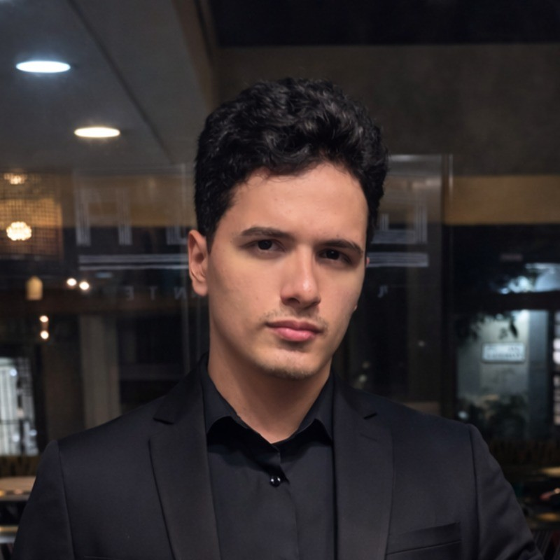

# Matheus Felipe Vieira Santiago

`Senior Full Stack Engineer`

Construo produtos web, mobile e cloud de alta disponibilidade há 6 anos — de sistemas atendendo 10k+ usuários/dia a um produto multi-tenant próprio para clínicas de saúde.

---

### 🚀 Sobre mim

- 🔭 Criador e mantenedor do [**Clinical System**](https://clinicalsystem.com.br/), um produto multi-tenant para clínicas odontológicas (50+ clientes pagantes), com integrações de IA (Whisper).
- 🛠️ Stack principal: **TypeScript** (Next.js, NestJS, React Native/Expo) e **.NET** (ASP.NET Core), de ponta a ponta — arquitetura, desenvolvimento e testes.
- ⚙️ Experiência com sistemas distribuídos, microsserviços, mensageria (Kafka, RabbitMQ) e design de sistemas para alta escala/concorrência.
- 🎥 Compartilho conteúdo sobre desenvolvimento web no meu canal do [YouTube](https://www.youtube.com/@matheus-felipe-dev).
- 🌱 Interesses atuais: integrações com IA, arquitetura multi-tenant e infraestrutura em nuvem (GCP/AWS, Docker, Kubernetes).
- 🎓 Formado em Análise e Desenvolvimento de Sistemas (ADS), com Pós-graduação em Especialização em Engenharia de Software e Arquitetura de Sistemas.

### 🧰 Linguagens e Tecnologias

  

### 📌 Projetos em destaque

| Projeto | Descrição | Stack |
| --- | --- | --- |
| [Clinical System](https://clinicalsystem.com.br/) | Produto multi-tenant para clínicas odontológicas | ASP.NET Core, Next.js |
| [MakeBio](https://www.makebio.com.br/) | SaaS brasileiro de link-in-bio, com Stripe | TypeScript |

### 🎤 Guildas e estudos internos

| Tema | Link |
| --- | --- |
| Estudo de viabilidade: Criptografia de Contratos de API (E2EE) | [Notion ↗](https://thrilling-lettuce-c76.notion.site/Estudo-de-Viabilidade-Criptografia-de-Contratos-de-API-E2EE-277af39e8feb80cf950dca4bd6ef4869) |
| CI/CD com GitHub Actions | [Notion ↗](https://thrilling-lettuce-c76.notion.site/GitHub-Actions-f26aaaf7a1e24288a8fa7fa902ca5fdf) |
| Introdução ao Desenvolvimento Orientado a Testes (TDD) | [Notion ↗](https://thrilling-lettuce-c76.notion.site/TDD-3c13ecbdeb574de5b8dcd9f83afea65c) |

📫 **Vamos conversar:** [matheus.felipe55391@gmail.com](mailto:matheus.felipe55391@gmail.com)

